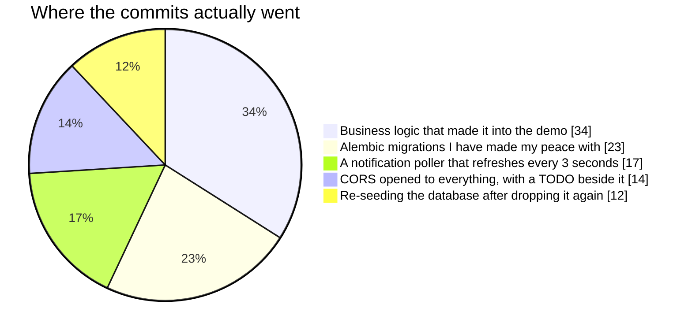

# Amirali Khodaei

Computer Engineering student at Sharif University of Technology, 7th semester.

I'm building **pol** — a freelancing platform aimed at university students.
The idea came from watching how people around me actually land their first paid
work: they know somebody. That seemed like a solvable problem, so this is my
attempt at solving it. It's a Flutter client on top of a FastAPI backend.

The direction I'm heading is AI/ML — that's what I want to do my graduate work
in, and what I want to build for a living.

📫 amiralikhodaei324@gmail.com

### What I build with

### What I'm moving toward

### What it all runs on

### An honest breakdown of the pol backend

<picture>
  <source media="(prefers-color-scheme: dark)" srcset="https://raw.githubusercontent.com/amiralikhodaei1384/pol-app/output/snake-dark.svg">
  <source media="(prefers-color-scheme: light)" srcset="https://raw.githubusercontent.com/amiralikhodaei1384/pol-app/output/snake-light.svg">
  
</picture>
